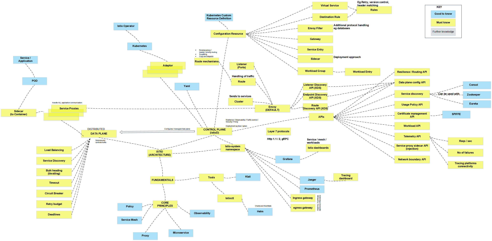

# Istio Engineer Quest

What makes an Istio Engineer, or more importantly a _good_ Istio Engineer? 

## Roadmap

## Resources
### Core Concepts
  * [Pluralsight - Managing Apps on Kubernetes with Istio](https://app.pluralsight.com/library/courses/istio-managing-apps-kubernetes/table-of-contents)
  * [Pluralsight - Istio is smaller faster and easier than even before](https://app.pluralsight.com/library/courses/allthetalks-session-98/table-of-contents)
 

### Cloud Platforms
  * [Pluralsight AWS Certified Cloud Practitioner Path](https://app.pluralsight.com/paths/certificate/aws-certified-cloud-practitioner)

#### Azure

#### AWS
* [Identity Access Management (IAM) - AWS Documentation](https://docs.aws.amazon.com/IAM/latest/UserGuide/introduction.html)

## Engineer Suggestions
