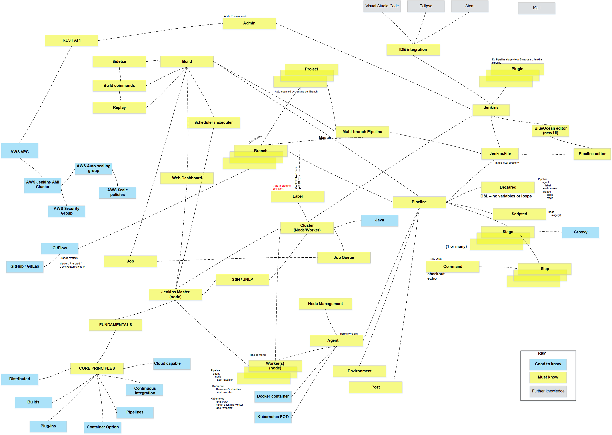

# Jenkins Engineer Quest

What makes a Jenkins Engineer, or more importantly a _good_ Jenkins Engineer? 

## Roadmap

## Resources
### Core Concepts
  * [Pluralsight  - Continuous Integration Path with Jenkins](https://app.pluralsight.com/paths/skill/continuous-integration-with-jenkins)

### Containers
  * [Pluralsight  - Creating and Managing Deployments with Knative and JenkinsX](https://app.pluralsight.com/channels/details/ba2b1477-cfad-4b7b-82a3-b855268ad404)

### Cloud Platforms
  * [Pluralsight AWS Certified Cloud Practitioner Path](https://app.pluralsight.com/paths/certificate/aws-certified-cloud-practitioner)
  * [Pluralsight AWS Certified Solutions Architect – Associate Path](https://app.pluralsight.com/paths/certificate/aws-certified-solutions-architect-associate)

#### Azure
* [Identity Access Management (IAM) - AWS Documentation](https://docs.aws.amazon.com/IAM/latest/UserGuide/introduction.html)

#### AWS
* [Amazon Kubernetes Service (EKS) and JenkinsX- AWS Documentation](https://aws.amazon.com/blogs/apn/modernize-your-ci-cd-pipeline-using-jenkins-x-with-amazon-eks/)
* [Amazon Device Farm (ADF) and Jenkins- AWS Documentation](https://aws.amazon.com/blogs/mobile/automated-device-testing-with-aws-device-farm-and-jenkins/)
* [Amazon Code Pipeline and Jenkins- AWS Documentation](https://aws.amazon.com/blogs/devops/setting-up-a-ci-cd-pipeline-by-integrating-jenkins-with-aws-codebuild-and-aws-codedeploy/)

## Engineer Suggestions
  * Learning docker concepts before moving onto something like Kubernetes is a huge help in understanding core concepts
  