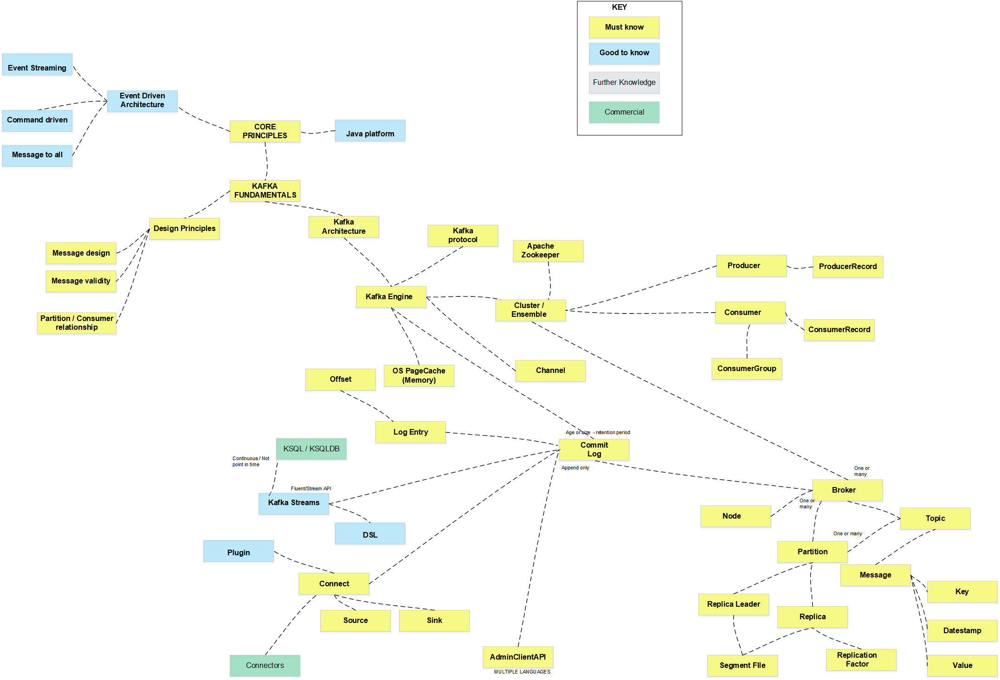

# Kafka Engineer Quest

What makes an Kafka Engineer, or more importantly a _good_ Kafka Engineer? 

## Roadmap

## Resources
### Core Concepts
  * [Pluralsight - Designing Event driven applications with Apache Kafka Ecosystem](https://app.pluralsight.com/library/courses/designing-event-driven-applications-apache-kafka-ecosystem/table-of-contents)
  * [Pluralsight - Getting started with Apache Kafka](https://app.pluralsight.com/library/courses/apache-kafka-getting-started/table-of-contents)
  * [Pluralsight - Kafka: build deploy and monitor real world applications](https://app.pluralsight.com/library/courses/kafka-build-deploy-monitor-real-world-application/table-of-contents)
  * [Pluralsight - Kafka connect fundamentals](https://app.pluralsight.com/library/courses/kafka-connect-fundamentals/table-of-contents)

#### Azure
  * [Azure - Java based example of using Consumer, Producer and streaming APIs](https://docs.microsoft.com/en-us/samples/azure-samples/hdinsight-kafka-java-get-started/hdinsight-kafka-java-get-started/)
  * [Azure - Kafka on HDInsight](https://docs.microsoft.com/en-us/azure/hdinsight/kafka/apache-kafka-introduction)

#### AWS
* [AWS Managed Streaming Service (MSK) - AWS Documentation](https://aws.amazon.com/msk/)
* [Best practices for Kafka on AWS - AWS Documentation](https://aws.amazon.com/blogs/big-data/best-practices-for-running-apache-kafka-on-aws/)

### Containerisation
  * [Pluralsight Getting Started with Docker](https://app.pluralsight.com/library/courses/docker-getting-started/table-of-contents)

## Certifications
  * [AWS Certified Cloud Practitioner](https://aws.amazon.com/certification/certified-cloud-practitioner/)

## Engineer Suggestions
  * Learning docker concepts before moving onto something like Kubernetes is a huge help in understanding core concepts
